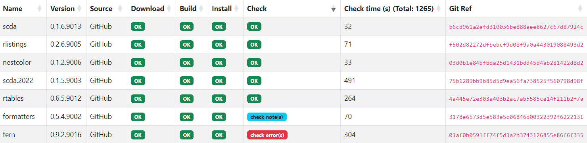

# scribe

[](https://github.com/insightsengineering/scribe/actions/workflows/test.yml)

`scribe` (acronym for `s`ystem `c`ompatibility `r`eport for `i`nstall & `b`uild `e`valuation) is a project that creates complete build, check and install reports for a collection of R projects that are defined in an [renv.lock](https://rstudio.github.io/renv/articles/lockfile.html) file.

`renv.lock` file can be typically generated by the `renv` R package, but you may also want to take a look at [`locksmith`](https://github.com/insightsengineering/locksmith) which can generate such a file more efficiently.

`scribe`, based on the input `renv.lock`:

* downloads R packages from package repositories or GitHub/GitLab repositories,
* determines the order in which the packages should be built and installed,
* builds packages from `git` repositories, and installs all of the packages (by running `R CMD build` and `R CMD INSTALL` respectively),
* checks the specified subset of packages by running `R CMD check`,
* generates an HTML report with the statuses of the above processes.



The statuses in the report shown above, when clicked, show the logs from the execution of `R CMD build`, `R CMD INSTALL`, or `R CMD check`.

## Installing

Simply download the project for your distribution from the [releases](https://github.com/insightsengineering/scribe/releases) page. `scribe` is distributed as a single binary file and does not require any additional system requirements other than `R`, with which it integrates and interfaces externally.

## Usage

`scribe` is a command line utility, so after installing the binary in your `PATH`, simply run the following command to view its capabilities:

```bash
scribe --help
```

Example usage with multiple flags:

* ```bash
  scribe --config custom-config-file.yml --logLevel debug --maskedEnvVars 'password|key|regexForAnEnvVarThatShouldNotBeDisplayed' --renvLockFilename output-renv.lock --reportDir output-report-directory
  ```
* Specifying for which packages `R CMD check` should be run, and which packages stored in `git` repositories should be updated with the newest version.
    ```bash
    scribe --checkPackage 'package*,*abc,a*b,someOtherPackage' --updatePackages 'gitPackage1,git*Package,*packageFromGit*'
    ```
* Changing the default number of concurrent goroutines for downloading packages, running `R CMD check`, and running package building and installation.
    ```bash
    scribe --maxDownloadRoutines 40 --maxCheckRoutines 10 --numberOfWorkers 20
    ```
* Passing additional options to `R CMD build`, `R CMD INSTALL` and `R CMD check`.
    ```bash
    scribe --buildOptions '--no-manual --no-build-vignettes' --installOptions '--no-docs' --checkOptions '--ignore-vignettes'
    ```

To download packages from `git` repositories, `scribe` uses Personal Access Tokens defined in environment variables:
* for GitLab, it reads the token from `GITLAB_TOKEN` variable,
* for GitHub, it reads the token from `GITHUB_TOKEN` variable.

## Configuration file

If you'd like to set the above options in a configuration file, by default `scribe` tries to read `~/.scribe`, `~/.scribe.yaml` and `~/.scribe.yml` files.
If any of these files exist, `scribe` uses options defined there, unless they are overridden by command line flags.

You can also specify a custom path to configuration file with `--config <your-configuration-file>.yml` command line flag.
When using custom configuration file, if you specify command line flags, the latter will still take precedence.

Example contents of configuration file:

```yaml
logLevel: debug
maskedEnvVars: secret-variable-name|another_variable_name
checkPackage: teal*,tern
updatePackages: teal*,tern
renvLockFilename: custom-renv.lock
outputReport: output-report-directory
maxDownloadRoutines: 40
maxCheckRoutines: 10
numberOfWorkers: 20
buildOptions: --no-manual --no-build-vignettes
installOptions: --no-docs
checkOptions: --ignore-vignettes
```

## Environment variables

`scribe` reads environment variables with `SCRIBE_` prefix and tries to match them with CLI flags.
For example, setting the following variables will override the respective values from configuration file:
`SCRIBE_LOGLEVEL`, `SCRIBE_CHECKPACKAGE`, `SCRIBE_RENVLOCKFILENAME`, `SCRIBE_UPDATEPACKAGES`, `SCRIBE_OUTPUTREPORT` etc.

The order of precedence is:

CLI flag → environment variable → configuration file → default value.

## Package repositories

If `scribe` should use source packages, then the repository URLs in the `renv.lock` header should point
to the location where the `/src/contrib` directory is located (without the trailing `/`), for example:

```json
"R": {
  "Repositories": [
    {
      "Name": "CRAN",
      "URL": "https://packagemanager.posit.co/cran/latest"
    }
  ]
}
```

For `scribe` to use binary packages, it expects the `renv.lock` to contain the repository definitions pointing to the binary repositories.

Examples of expected format of binary repository URLs:

* Linux:
  * `https://packagemanager.posit.co/cran/__linux__/<distribution-name>/latest`
* Windows:
  * `https://cloud.r-project.org/bin/windows/contrib/<r-version>`
  * `https://www.bioconductor.org/packages/release/bioc/bin/windows/contrib/<r-version>`
  * `https://packagemanager.posit.co/cran/latest/bin/windows/contrib/<r-version>`
* macOS:
  * `https://cloud.r-project.org/bin/macosx/contrib/<r-version>`
  * `https://www.bioconductor.org/packages/release/bioc/bin/macosx/big-sur-arm64/contrib/<r-version>`
  * `https://www.bioconductor.org/packages/release/bioc/bin/macosx/big-sur-x86_64/contrib/<r-version>`
  * `https://packagemanager.posit.co/cran/latest/bin/macosx/big-sur-x86_64/contrib/<r-version>`
  * `https://packagemanager.posit.co/cran/latest/bin/macosx/big-sur-arm64/contrib/<r-version>`

where `<r-version>` is e.g. `4.2`, `4.3` etc.

In all cases the URL points to a directory where the `PACKAGES` file is located, without the trailing `/`.

Additionally, on Windows it might be required to tell `scribe` where the R executable is located by using flag: `--rExecutablePath 'C:\Program Files\R\R-4.3.2\bin\R.exe'`.

## Cache

`scribe` uses cache stored in `/tmp/scribe` for various purposes.

The results of download, installation, build and check stages are stored in `/tmp/scribe/cache`. When `scribe` detects presence of files with such results, it skips respective stages.

In order to run the download, installation, build and check from scratch, the `/tmp/scribe/cache` directory should be removed manually. Removing whole `/tmp/scribe` directory is also possible - in that case, the packages will have to be downloaded again because cached `tar.gz` packages and `git` repositories are stored in this directory.

The cache can also be cleared with `--clearCache` flag.

## Development

This project is built with the [Go programming language](https://go.dev/).

### Development Environment

It is recommended to use Go 1.21+ for developing this project. This project uses a pre-commit configuration and it is recommended to [install and use pre-commit](https://pre-commit.com/#install) when you are developing this project.

### Common Commands

Run `make help` to list all related targets that will aid local development.

### Style

This project adopts the [Uber styleguide](https://github.com/uber-go/guide/blob/master/style.md).

## License

`scribe` is licensed under the Apache 2.0 license. See [LICENSE.md](LICENSE.md) for details.
