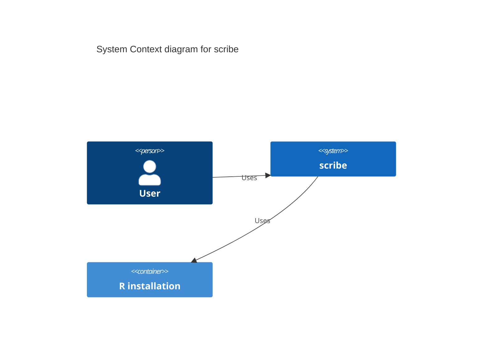
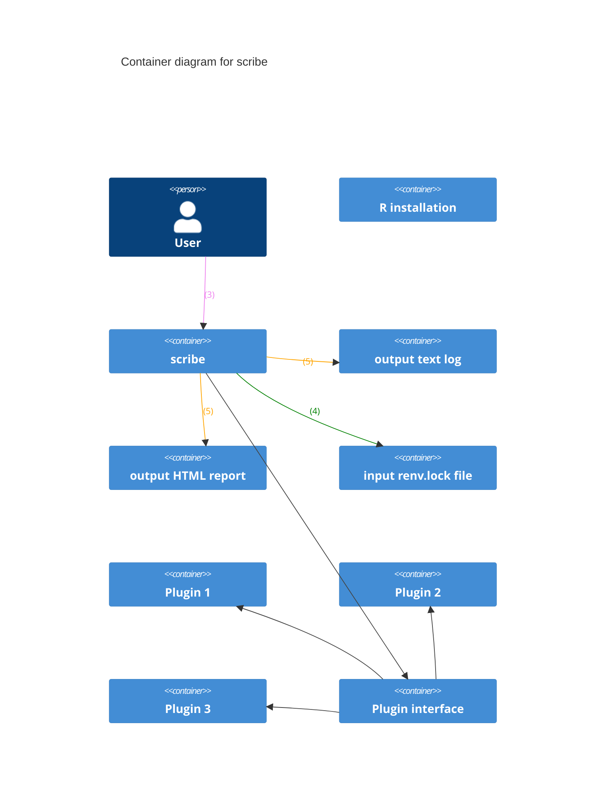

```mermaid
C4Component
  title Component diagram for scribe
  UpdateLayoutConfig($c4ShapeInRow="3", $c4BoundaryInRow="1")
      Container_Boundary(b1, "scribe", "scribe") {
        Component(cli_args_parser, "CLI arguments parser", "", "parses arguments passed to CLI")
        Component(renv_parser, "renv.lock parser", "", "reads input renv.lock file; based on that and on dependencies<br />from DESCRIPTION files of the packages in renv.lock, it creates a list of all packages<br />that have to be installed and their dependencies")
        Component(installed_packages_exporter, "installed packages exporter", "", "exports list of all installed R packages in given time moment")
        Component(dependency_resolver, "dependency resolver", "", "determines the order of package installation,<br />and sets of packages that can be installed concurrently")
        Component(installation_controller, "installation controller", "", "executes subprocesses responsible for parallel downloading,<br />building, installing and checking pacakges")
        Component(package_downloader, "package downloader", "", "downloads packages from various sources such as:<br />GitHub, R package managers etc.")
        Component(package_builder, "package builder", "", "builds R package")
        Component(package_installer, "package installer", "", "installs R package")
        Component(package_checker, "package checker", "", "tests R package")
        Component(scribe_reporter, "scribe report generator", "", "based on logs, creates HTML report<br />with package installation details")
        Component(html_templates, "HTML templates", "", "HTML templates used to<br />generate HTML report")
      }

      Container_Boundary(b2, "plugin interface", "plugin interface") {
        Component(plugin_loader, "plugin loader")
        Component(plugin_executor, "plugin executor")
      }

    Container(output_html_report, "output HTML report")
    Container(input_renv_lock, "input renv.lock file")

  Rel(installation_controller, package_installer, "(1)")
  Rel(installation_controller, package_builder, "(1)")
  Rel(installation_controller, package_checker, "(1)")
  Rel(installation_controller, package_downloader, "(1)")
  UpdateRelStyle(installation_controller, package_installer, $textColor="blue", $lineColor="blue")
  UpdateRelStyle(installation_controller, package_builder, $textColor="blue", $lineColor="blue")
  UpdateRelStyle(installation_controller, package_checker, $textColor="blue", $lineColor="blue")
  UpdateRelStyle(installation_controller, package_downloader, $textColor="blue", $lineColor="blue")

  Rel(renv_parser, input_renv_lock, "(4)")
  Rel(scribe_reporter, html_templates, "(4)")
  UpdateRelStyle(renv_parser, input_renv_lock, $textColor="green", $lineColor="green")
  UpdateRelStyle(scribe_reporter, html_templates, $textColor="green", $lineColor="green")

  Rel(dependency_resolver, package_downloader, "(7)")
  UpdateRelStyle(dependency_resolver, package_downloader, $textColor="lime", $lineColor="lime")

  Rel(renv_parser, dependency_resolver, "(2)")
  Rel(dependency_resolver, installation_controller, "(2)")
  UpdateRelStyle(renv_parser, dependency_resolver, $textColor="red", $lineColor="red")
  UpdateRelStyle(dependency_resolver, installation_controller, $textColor="red", $lineColor="red")

  Rel(cli_args_parser, renv_parser, "calls")
  Rel(cli_args_parser, installed_packages_exporter, "(6)")
  Rel(installation_controller, installed_packages_exporter, "(6)")
  UpdateRelStyle(cli_args_parser, installed_packages_exporter, $textColor="navy", $lineColor="navy")
  UpdateRelStyle(installation_controller, installed_pacakges_exporter, $textColor="navy", $lineColor="navy")

  Rel(scribe_reporter, output_html_report, "(5)")
  UpdateRelStyle(scribe_reporter, output_html_report, $textColor="orange", $lineColor="orange")
```

# `scribe`: System Compatibility Reports for Install & Build Evaludation

## Status

Proposed

## Decision

The goal is to rewrite this software from scratch in a modern programming language, using
best software engineering practices. The features that are deemed important include:

* good user interface and user experience: both for CLI usage and output, as well as installation
  report appearance
* increased speed of operation: especially thanks to replacing sequential with parallel R package
  installation

## Consequences

The consequences to this change are:

* shorter installation time of R packages because of performace improvements related to the
  technology used
* easier maintainance of the tool itself
* the possibility to share the source code of the tool to a broader comminity (on GitHub)
* distribution of the tool as a single binary will make it easier to use in automated pipelines
* better user experience for anyone who would like to use it for their purposes
* HTML reports that incorporate the best UI/UX practices

Legend:

* (3) - uses
* (4) - reads
* (5) - writes to

Legend:

* (1) - calls parallel instances of
* (2) - delivers data to
* (3) - uses
* (4) - reads
* (5) - writes to
* (6) - requests list of installed packages
* (7) - requests dependencies of packages
