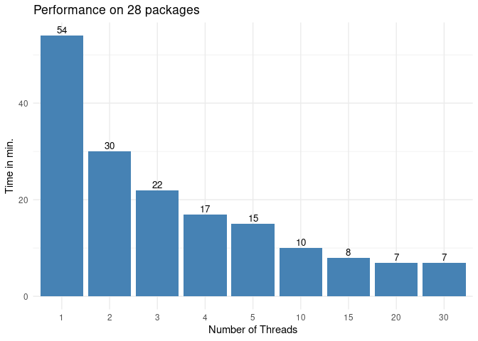

# Benchmark of scribe

## Explanation of terms

“Number of Threads” is the maximum number of simultaneously running
installations of R packages.

“Highly Dependent Package” is an R package which has a lot dependencies
on other R packages.

“Non-Dependent Package” is an R package without dependencies on other R
packages.

“Low Dependent Package” is a R package which has few (1 or 2 )
dependencies on Non-dependent Packages

### Disclaimer

“scribe” is a very complex program that performs many disk read-write
operations as well as queries to web services.

“scribe” invokes “R CMD\` check where execution times can vary greatly.

The results obtained in this test may not match your results, because
they depend on parameters of the server on which it was run, speed of
your internet connection and the choice of R packages.

## Installing packages with different numbers of threads

The more threads, the shorter the installation of all packages. This
relationship is not linear.

We get to the point where the extra threads don’t speed up the overall
process. It is so, because Highly Dependent Package which has tightly
coupled packages do not allow parallelisation. The last packages in the
installation list are run sequentially.

At the beginning of the installation process, Non-dependent Package are
being installed as a first packages. They do not have dependencies, so
parallelisation is done quite effectively.

## Installing packages and Strongly Connected Packages

For a large number of packages, Strongly Connected Packages may appear.
Strongly Connected Packages are a group of packages, where if he wants
to use one package, he will have to install a whole horde of other
packages Examples: “dplyr” with “tibble”, “rlang”, “vctrs” or “devtools”
with “cli”, “pkgdown”, “rcmdcheck”, “remotes”, “roxygen2”.

If there is a Highly Dependent Package then there should be Strongly
Connected Packages.

The topological sorting algorithm considers Strongly Connected Packages
to parallelize effectively. This is not always the case, as some
packages do not have a complete description of all the packages they
require for installation. In launches, we can observe it, when there is
an increased number of threads and the installation execution time
decreases significantly.

## renv and scribe

In summary, “scribe” can install packages much faster than “renv” will
ever do. Even if, “renv” will use “pak” package for downloading
packages, “scribe” will be faster, because it used parallelization for
download, build, installation process.

## Checks in scribe

We missed one feature in the renv. It was running “R cmd checks” on
several packages. We have parallelized this procedure.

Here are the result for running only checks.

