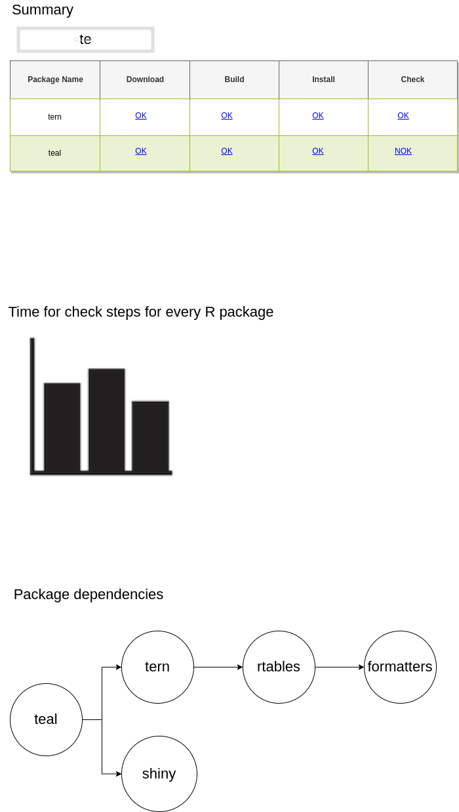

Scribe_UI.bmpr is a binary file. You will need [Balsamiq application](https://balsamiq.com/wireframes/) to use it.

UI components:

* The most important part of report is datatable with installed R packages and summary of every step. We should have possibility to see the output of every step for every installed package.
* Search bar will be helpful for finding the package name
* when multiple steps will be run, we would like to have a forever view of duration package. That way, we will know if `check` step for a given package is taking longer than usually.
* Dependency graph will let us know if we could do some optimization.

